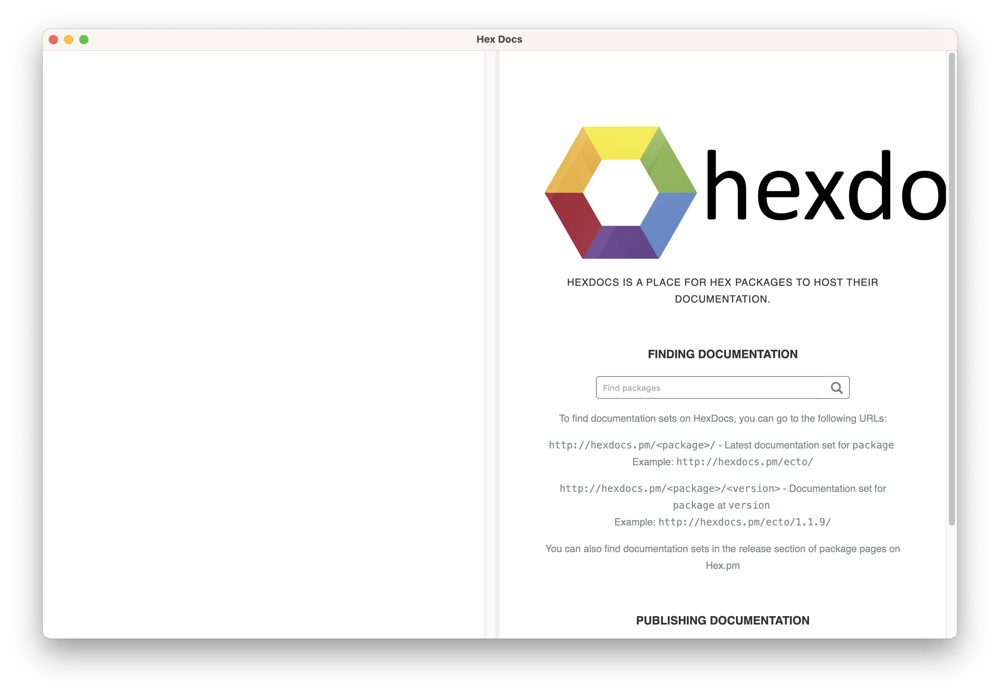

# HexDocs

Simple proof of concept of an standalone app of HexDocs + Text area with `Code.eval_string` using Bakeware and wxWidgets.

## Build binary
Simply build a release.
  * `mix release`

Please check [Bakeware](https://github.com/bake-bake-bake/bakeware) documentation to know more about requirements for your target system
